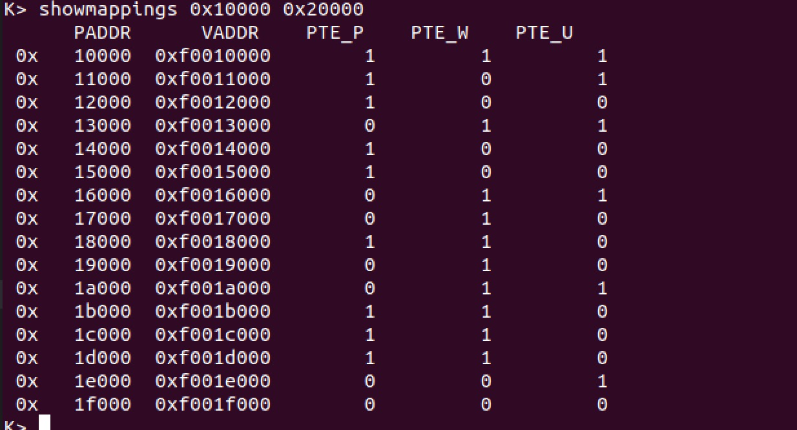

# LAB2
- 516030910115
- 吴志文
### Q1
- Assuming that the following JOS kernel code is correct, what type should variable x have, uintptr_t or physaddr_t?
```c
	mystery_t x;
	char* value = return_a_pointer();
	*value = 10;
	x = (mystery_t) value;
```
### A1
- uintptr_t．任何指针指向的都是虚拟地址.


### Q2
- What entries (rows) in the page directory have been filled in at this point? What addresses do they map and where do they point? In other words, fill out this table as much as possible:
### A2

| Entry | Base Virtual Address | Points to (logically):                |
| ----- | -------------------- | ------------------------------------- |
| 1023  | 0xFFC00000           | Page table for [252,256)MB of physical memory |
| 1022  | 0XFF800000           | ???
| ...   | ...                  | ...                                   |
| 960   | 0xF0000000           | Page table for [0,4) MB of physical memory|
| 959   | 0xEFC00000           | Empty memory                     |
| 958   | 0xEF800000		   | Mapped kernel stack				   |
| 957   | 0xEF400000           | Current unmapped                   |
| 956   | 0xEF000000           | Read-Only Pages                       |
| ...   | ...                  | ...                                   |
| 0     | 0x00000000           | Empty memory(*)                       | 

### Q3
-  (From Lecture 3) We have placed the kernel and user environment in the same address space. Why will user programs not be able to read or write the kernel's memory? What specific mechanisms protect the kernel memory?
### A3
- MMU 在翻译地址的时候会检查 pde 和pte 上的权限位 PTE_U.PTE_U is not enabled.
### Q4 
- What is the maximum amount of physical memory that this operating system can support? Why?
### A4
- 2GB. UPAGES有4MB，一个pageInfo 8个Byte,4MB / 8B = 512KB。 页大小为4KB，512KB * 4 KB = 2GB.
### Q5 
- How much space overhead is there for managing memory, if we actually had the maximum amount of physical memory? How is this overhead broken down?
### A5
- 
	- page directory: 1024*32bit=4K
	- page table: 0x80000*32bit=2MB
	- pages: 0x80000*8B=4MB
- 页表占据相当大space,可以使用大页

### Q6 
- Revisit the page table setup in kern/entry.S and kern/entrypgdir.c. Immediately after we turn on paging, EIP is still a low number (a little over 1MB). At what point do we transition to running at an EIP above KERNBASE? What makes it possible for us to continue executing at a low EIP between when we enable paging and when we begin running at an EIP above KERNBASE? Why is this transition necessary?
### A6
- entry.S
	- `jmp *eax`
- 有必要,因为 kern/entrypgdir.c 这个函数手动把物理内存的 0~4M 映射到虚拟内存的 KERNBASE~KERNBASE+4M 处。

## challenge
- showmappings
判断showmapings的参数是否为2，并将begin和end按页大小取整，并按页大小增加
showmappings 返回permission bits
